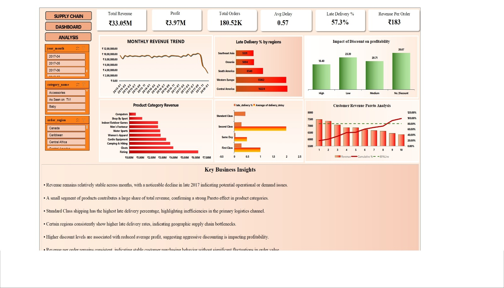

# 📦 Supply Chain Performance & Risk Analysis

## 📌 Project Overview

This project analyzes supply chain operations using **Python, SQL, and Microsoft Excel** to identify operational bottlenecks, monitor key business KPIs, and evaluate delivery risks.

The analysis focuses on warehouse performance, regional sales, delivery efficiency, profitability, and customer service metrics to support data-driven business decisions.
## 📊 Dashboard Preview

---

## 🎯 Business Problem

Supply chain teams often monitor deliveries and sales independently, making it difficult to identify operational risks that directly impact revenue and customer satisfaction.

This project combines operational and financial data to answer important business questions such as:

- Which regions experience the highest delivery delays?
- Which warehouses handle the maximum orders?
- How do delayed deliveries affect profitability?
- Which product categories generate the highest revenue?
- Which shipping methods perform the best?

---

# 🛠 Tools & Technologies

- Python (Pandas, NumPy)
- MySQL
- Microsoft Excel
- Git
- GitHub

---

# 📊 Key KPIs

- Total Revenue
- Total Profit
- Order Volume
- Average Delivery Time
- Late Delivery Rate
- Warehouse Performance
- Regional Sales
- Product Category Performance
- Shipping Performance

---

# 📈 Dashboard Features

- Executive KPI Summary
- Warehouse Performance Analysis
- Regional Sales Distribution
- Delivery Performance Monitoring
- Product Category Analysis
- Risk Identification
- Interactive Excel Dashboard

---

# 📌 Business Insights

The analysis helps identify:

- High-risk delivery regions
- Operational bottlenecks
- Warehouse performance trends
- Revenue-generating product categories
- Delivery efficiency improvements
- Business opportunities for process optimization

---

# 🚀 Skills Demonstrated

- Data Cleaning
- Exploratory Data Analysis
- SQL Querying
- Business Intelligence
- KPI Reporting
- Supply Chain Analytics
- Dashboard Development
- Data Visualization

---

# 🔮 Future Enhancements

- Power BI Dashboard
- Demand Forecasting
- Inventory Optimization
- Predictive Analytics
- Machine Learning for Delivery Delay Prediction

---

# 👨‍💻 Author

**Omm Prakash Swain**

B.Tech Electrical Engineering  
National Institute of Technology Rourkela

Interested in Data Analytics, Business Intelligence, Supply Chain Analytics, and Operations Analytics.
